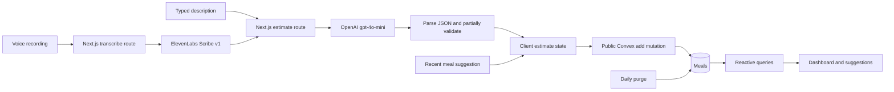

# Yskas foundational architecture review

Review date: September 21, 2026. Repository baseline: `d48ef76`.

**Recommendation: keep the existing stack and invest in data correctness, authorization, and evaluation before extending nutrition tracking.** The application is small. Most complexity is concentrated in meal entry and its asynchronous states; most risk is concentrated at the API, database, and nutrition boundaries. A rewrite, agent framework, or new database would add work without addressing the main problems.

This is a proposal only. No application, UI, schema, dependency, or deployment changes were made. The review covers all handwritten application/backend files, configuration, existing tests, dependency auditing, and available Convex health insights. UI findings come from source inspection, not a browser usability or accessibility audit.

“Jev as a judge” remains unconfirmed. No Jev dependency, configuration, or integration was found. The evaluation proposal below provisionally interprets it as LLM-as-a-judge; it does not assume a particular product or model.

## Evidence and limits

| Check | Result |
| --- | --- |
| Application size | 23 files / 1,907 physical lines across application, library, handwritten Convex TypeScript, CSS, and tests; excludes generated files and configuration |
| Largest component | `app/(app)/meal-input.tsx`: 421 lines; voice hook: 180 lines |
| Production build | Passed with Next.js 16.2.10 |
| TypeScript | `tsc --noEmit --incremental false` passed |
| ESLint | No errors; four warnings in generated Convex files |
| Existing tests | All five voice-recording tests passed |
| Convex insights | Configured deployment reported no issues over the preceding 72 hours; this was not an explicit `--prod` inspection |
| Production dependency audit | Seven affected dependency entries: one critical, four high, two moderate; npm reports fixes available |
| Local behavioral probes | Actual handlers executed with mocked providers/database: cleanup repeats without progress; negative nutrition and empty meal names are accepted; whitespace invokes estimation; malformed JSON escapes the route's error handler |
| Paid model requests | None made |
| Production data mutation | None performed |

The handler probes transpiled the actual files and supplied controlled dependencies in a local VM. They demonstrate code behavior, not live endpoint exploitation. The existing hook tests similarly use controlled browser mocks and do not establish real mobile-browser behavior.

No request-volume, OpenAI billing, ElevenLabs billing, real-user latency, browser performance trace, or labeled nutrition dataset was available for this review. There is consequently no measured accuracy baseline, cost-per-meal baseline, or justified percentage savings forecast. Healthy Convex insights do not certify security, numerical accuracy, retention correctness, or every performance dimension.

## Current architecture

Typed entry previews an estimate before saving. Voice entry transcribes, estimates, and automatically saves. Selecting a recent meal bypasses OpenAI, but copies numbers without preserving the original description or source linkage. The Next.js PIN gate and browser-selected profile do not authenticate the Convex connection.

Useful foundations already exist: a small dependency surface, strict TypeScript, indexed daily meal reads, a short one-shot prompt, no conversation-history payload, an isolated voice hook, silence detection, a recording duration limit, reduced-motion configuration, and meal reuse that can avoid model calls. Preserve these advantages.

## Findings, ordered by impact

### F1 — P0: Authorization does not protect data or paid endpoints

Evidence: [proxy.ts](../proxy.ts#L6), [PIN route](../app/api/verify-pin/route.ts#L19), [meal functions](../convex/meals.ts#L4), [user functions](../convex/users.ts#L4), [Convex provider](../app/convex-provider.tsx#L12).

The proxy explicitly permits every `/api/` path. Neither estimation nor transcription verifies a session. The PIN cookie is the literal value `true`, with no signature or server-side session verification. A caller can supply that cookie without knowing the PIN. There is no application rate limiting on PIN attempts or provider calls.

Convex queries and mutations are public and never call `ctx.auth.getUserIdentity()`. Listing profiles, reading another profile's meals, modifying goals/names, and deleting meals depend on caller-supplied IDs. A browser profile selection is not an authorization boundary. The backend remains accessible independently of the Next.js proxy.

**Proposal:** establish one verified identity/session model and authorize at every server boundary. Keep profile switching if this is a household application, but check that the authenticated principal may access the selected profile. Protect the provider routes, enforce ownership or household membership in Convex, and add per-principal request/concurrency quotas. Keep the proxy for navigation convenience. This matches the installed Next.js authentication guide and [Convex's access-control guidance](https://docs.convex.dev/understanding/best-practices/).

Use standard Convex-compatible authentication rather than inventing a token service. Decide household versus individual access before choosing the provider. The current visual flow can remain while its trust model is corrected. Add session expiry/revocation and secure cookie settings as part of that work.

### F2 — P0: Retention silently removes history; cleanup can repeatedly schedule itself

Evidence: [convex/crons.ts](../convex/crons.ts#L5).

The daily job deletes meals with date keys older than its seven-day cutoff. This removes potential history, repeat-meal examples, and material for evaluating estimates. Whether this short retention is intentional is a product decision; it should not be an incidental performance mechanism.

The job reads the first 100 meals, filters those rows in memory, and schedules another immediate invocation whenever the original batch has 100 rows. With 100 retained meals, it deletes nothing and schedules itself again over the same rows. Older backdated entries beyond the first batch can also remain unreachable while retained rows occupy the batch.

The local probe ran the real handler twice with 100 retained rows: **two reads, zero deletions, two scheduled invocations**. The failure persists until the relevant data or cutoff changes; this is not proof it is currently occurring in production.

**Proposal:** settle retention explicitly and preserve/export data before any retention migration. My recommendation for a tracker is to retain meal history and independently limit the suggestion window. If deletion remains required, query eligible rows through a date index, process bounded batches, and require progress before scheduling continuation. Use a fixed cutoff throughout a run. Define timezone and inclusive cutoff behavior explicitly.

### F3 — P0/P1: Dependency vulnerabilities require maintenance before feature work

Evidence: `npm audit --omit=dev --json`, package lock, installed Next.js 16.2.10 and Convex 1.35.1.

| Dependency entry | Audit severity |
| --- | --- |
| next | Critical |
| nanoid | High |
| postcss | High |
| sharp | High |
| ws | High |
| convex | Moderate, inherited through ws |
| baseline-browser-mapping | Moderate |

These are dependency entries, not seven independently demonstrated exploits. Some refer to build tooling or optional framework surfaces. Reachability must be assessed against the actual deployment.

Two Next.js advisories list 16.3.3 as a patched version: [Windows-hosted server RCE](https://github.com/vercel/next.js/security/advisories/GHSA-p293-qw3h-jr36) and [AVIF image optimization RCE](https://github.com/vercel/next.js/security/advisories/GHSA-2xp9-vwfh-vxw4). Local development uses Windows; production hosting was not verified. The separate [Turbopack proxy bypass advisory](https://github.com/vercel/next.js/security/advisories/GHSA-6gpp-xcg3-4w24) requires a single configured i18n locale, which this repository does not configure. Do not claim that specific exploit applies merely because npm flags the installed version.

**Proposal:** make a focused dependency-maintenance change, use a supported release that addresses all applicable advisories at implementation time, align `eslint-config-next` with Next.js, and rerun build/tests/audit. Avoid a blind forced audit fix. A patch does not repair F1's application-level authorization failures.

### F4 — P1: Numeric and request validation is insufficient

Evidence: [estimate route](../app/api/estimate/route.ts#L20), [transcribe route](../app/api/transcribe/route.ts#L9), [meal mutation](../convex/meals.ts#L34), [goal mutation](../convex/users.ts#L28).

The estimator accepts any nonempty string, including whitespace, with no application length limit. `req.json()` runs outside its try/catch. The response only requires a string name and numeric calories; negative numbers, empty names, missing macros, and implausible combinations can pass. Runtime TypeScript interfaces do not validate JSON. `v.number()` similarly provides no nutritional range or finite-number business rule.

A local response of `{name: "", calories: -100, protein: -20}` was returned successfully. Invalid persisted values can also break the dot grid, where calculated counts become array lengths. Zero or negative goals are accepted by the backend despite form constraints.

The transcription route accepts any Blob without an application size limit, MIME allowlist, or empty-file rejection. Client recording limits do not constrain direct HTTP clients. Both malformed multipart and malformed JSON need controlled errors before provider work begins.

**Proposal:** share business validation across estimator output, manual overrides, saved-meal reuse, and Convex writes. Require finite nonnegative nutrient quantities, a nonblank bounded name/description, valid dates, and valid positive goals. Zero-calorie items are legitimate and should remain supported. Separate hard rejection of impossible shapes from soft plausibility flags for unusually large meals. Bound requests before expensive parsing/provider work and distinguish invalid input, provider refusal, timeout, and upstream failure.

### F5 — P1: The nutrition model cannot yet support the stated tracking goal reliably

Evidence: [schema](../convex/schema.ts#L10), [prompt](../app/api/estimate/route.ts#L4), [daily totals](../app/(app)/page.tsx#L155), [dot calculation](../app/(app)/page.tsx#L29).

Fiber is absent from the prompt, response type, mutation arguments, stored meals, and totals. Protein is optional and summed with `protein ?? 0`, conflating unknown with zero. There is no source, serving basis, uncertainty status, prompt version, model version, or correction history.

The colored protein dots use `4 × protein grams / calorie goal`. That measures contribution toward the calorie budget. It is different from `4 × protein grams / calories consumed`, the fraction of consumed calories attributable to protein. The grid also caps intake at the goal and remaining calories at zero, so over-goal intake is not represented by those summary values. Each of 50 dots represents 2% of the goal; it is a coarse visualization, not a precise percentage calculation.

**Proposal:** first define a pure nutrition domain module and test its semantics. Store quantities and derive percentages. Treat absent nutrient data as unknown, expose completeness in calculated results, and distinguish observed/label-derived quantities from model estimates. Preserve source calorie totals; do not force them to equal rounded macro arithmetic.

### F6 — P1: Editing and reuse can produce misleading nutrient records

Evidence: [calorie edit](../app/(app)/meal-input.tsx#L148), [suggestion deduplication](../app/(app)/meal-input.tsx#L69), [suggestion selection](../app/(app)/meal-input.tsx#L171), [save](../app/(app)/meal-input.tsx#L273).

Only calories can be edited in the estimate preview. Protein, carbs, and fat retain their old values, and the original estimate is lost on save. That may be a legitimate calorie correction, but the record cannot distinguish it from a serving-size change that should affect every nutrient.

Suggestions deduplicate by generated meal name, so differently sized or composed meals can collapse into one. Selecting a suggestion copies its nutrition but leaves the currently typed description untouched. Typing “two slices” and selecting an old one-slice estimate can therefore save one-slice numbers with a two-slice description. No original meal reference or serving basis is recorded.

**Proposal:** define explicit operations for copying an identical serving, scaling a serving, and overriding an individual quantity. Preserve the source input and original estimate, track changed fields, and keep an immutable consumed-meal snapshot. Search similarity should nominate candidates, not establish nutritional equivalence. Old unknown fiber values must remain unknown when copied.

### F7 — P1: Prompt-only JSON and ungrounded estimation limit accuracy

Evidence: [OpenAI request](../app/api/estimate/route.ts#L39).

The model is instructed to return JSON, but neither JSON mode nor strict Structured Outputs is enabled. Refusals and finish reasons are not classified. All failures become a generic 500. The 150-token response limit may be adequate for today's small response; its suitability for a richer contract is untested.

The prompt asks the model to guess typical US portions when information is missing. There is no reference-food lookup or serving normalization. A second model could agree with the same unsupported assumption without improving truth.

**Proposal:** use strict Structured Outputs plus independent business validation. The current `gpt-4o-mini` supports this in Chat Completions, so it does not require an API or model migration. Schema adherence still does not establish nutritional accuracy. See [official Structured Outputs documentation](https://developers.openai.com/api/docs/guides/structured-outputs).

Prioritize explicit user quantities, units, preparation state, and supplied label values. For ambiguous descriptions, preserve uncertainty instead of manufacturing confidence. Introduce a bounded reference-data interface only after evals identify where it improves accuracy. USDA provides food search/detail APIs that can supply reference nutrient data, but portion matching and cooked-versus-raw selection remain application responsibilities. See [USDA FoodData Central](https://fdc.nal.usda.gov/api-guide/).

### F8 — P1: No quality, latency, or cost observability

Evidence: the estimate route discards `completion.usage`, request metadata, finish reason, and model response identity; no evaluation corpus or runner exists.

There is no way to answer whether a prompt change improves calorie, protein, or fiber accuracy, whether transcription is the main delay, or how many paid estimates are abandoned before save. An unmeasured judge could increase both cost and latency without improving the numbers.

**Proposal:** record a small structured event per attempt: correlation ID, input mode, model and prompt/schema versions, input/output/cached tokens when available, duration, attempt/retry count, result category, reuse/fallback/judge outcome, and saved/abandoned outcome when observable. Track transcription duration/bytes and provider cost separately. Keep operational events out of broadly subscribed profile/meal documents. Start with existing structured logs and aggregation; add a separate short-retention run table only if asynchronous judging or durable correlation requires it.

Raw food descriptions, transcripts, and audio should not be routinely copied into generic logs. For chosen eval fixtures, retain only the data needed to reproduce the case under an explicit policy.

### F9 — P1/P2: Request lifecycles and persistence lack a common policy

Evidence: [client requests](../app/(app)/meal-input.tsx#L25), [voice callback](../app/(app)/meal-input.tsx#L214), [voice lifecycle](../app/(app)/use-voice-recording.ts#L24), provider route handlers.

The voice path supplies an AbortSignal to browser fetches; typed estimation does not. Neither server route passes request cancellation to its provider call. The installed OpenAI SDK defaults to a ten-minute timeout and two retries (`node_modules/openai/src/client.ts`); the application does not override these. Hosting may terminate the request earlier, leaving an inconsistent timeout policy. Transcription fetch has no explicit application deadline.

The client maintains overlapping loading, transcribing, saving, recording, starting, estimate, and error states. Voice auto-save and typed preview/save have different orchestration. Backgrounding stops capture, but does not itself abort an already running provider pipeline; route/enable cleanup does. These behaviors need an explicit contract.

`meals.add` has no logical operation key. Convex transport retry semantics should not be confused with repeated user submissions: a new submission of the same logical save can still create another meal. There is also no stable estimate identity that ties an accepted result to a later save.

**Proposal:** one typed meal-entry state transition model and a request generation ID, keeping the existing interaction policy initially. Apply finite deadlines, bounded retries, and cancellation where supported. Guarantee database save idempotency using a client operation ID scoped to the authorized profile. Keep estimation and saving separately recoverable; retries of saving should reuse the validated estimate. Provider cancellation may reduce work but cannot guarantee a billing refund.

### F10 — P2: Suggestion reads scale with all retained meals

Evidence: [forDateRange](../convex/meals.ts#L20), [suggestion hook](../app/(app)/meal-input.tsx#L54).

The query reads every meal for the user and then filters date strings in JavaScript. Its cost grows with retained history rather than the requested seven-day window. That becomes more relevant if retention is fixed. Daily reads already use a suitable compound index.

The layout always mounts `MealInput`, including on settings, where it is moved offscreen. Its suggestion query still runs, including when the description is empty or an estimate is already available. The dashboard also subscribes to all profiles through the layout although it needs the selected profile.

**Proposal:** use the existing user/date index for an explicit date interval; validate interval size and bound suggestion results. If an arbitrary date set is still needed, use bounded indexed date reads. Pause suggestion work when irrelevant and keep the selected-profile subscription narrow. Daily nutrition totals must include all meals: do not cap a daily query silently and then calculate incomplete totals.

Do not add summary tables, Redis, or an aggregate component without measurements. A household application's indexed day/week reads are small. New arrays of identical query arguments are not, by themselves, proof of redundant Convex network subscriptions.

### F11 — P2: Date and profile recovery semantics are incomplete

Evidence: [date helpers](../lib/dates.ts#L1), [dashboard query](../app/(app)/page.tsx#L140), [save date](../app/(app)/meal-input.tsx#L284), [layout](../app/(app)/layout.tsx#L22), [profile context](../lib/user-context.tsx#L20).

“Today” is computed at render time; an idle page has no midnight refresh. A date is assigned when a meal saves, so a request crossing midnight can fall on a different day from capture. The browser supplies local dates, while cleanup uses its server runtime's calendar. No timezone policy is stored.

The layout verifies that some profiles exist, not that the stored selected profile exists. A stale profile ID can leave the dashboard loading forever. Local storage is cast to a Convex ID without validation or recovery, and storage access errors are not handled.

**Proposal:** define the logging timezone, capture event time/date once per operation, and refresh the active day at midnight and on visibility restoration. Preserve historical date keys during migration. Recover invalid/deleted profile selections explicitly. Do not infer historical timezones or meal dates from insufficient data.

### F12 — P2: Test coverage is narrow despite a green build

Evidence: [voice tests](../tests/voice-recording.test.mjs), [package scripts](../package.json#L5).

The five tests cover valuable recording behavior. There are no tests for authorization, API validation, nutrients, repeated saves, range queries, retention, date rollover, or the full voice-to-save flow. No `test` script or checked-in CI workflow exists. The voice harness does not exercise normal React rerenders or actual browser codecs.

**Proposal:** add focused tests for the invariants listed later, expose one repeatable verification command, and add a minimal CI workflow. Use the project's prescribed `convex-test` approach for database authorization and transaction behavior. Keep a short real-browser smoke test for typed input, voice input, settings, and profile switching.

### F13 — P3: Small cleanup opportunities exist; avoid turning them into a rewrite

Evidence: [unused shimmer](../app/(app)/shimmer-text.tsx), [utility](../lib/utils.ts), [README](../README.md), [animation setup](../app/(app)/layout.tsx#L7).

`ShimmerText` is unreferenced; its `cn` helper is the only use of `clsx` and `tailwind-merge`. Removing this unused branch would reduce maintenance and direct dependency declarations. It does not establish a shipped JavaScript saving because unused modules may already be excluded from bundles. Several starter SVG assets are also unused.

The README still describes removed add/history routes and says `npm run dev` starts Convex, while the script starts only Next.js. Document the ElevenLabs dependency, environment variable names without values, actual commands, and retention policy. Exclude generated Convex files from handwritten lint policy rather than changing generated code.

Consider the lighter Motion feature bundle only after verifying current animation needs and measuring bundle impact. React Compiler is already enabled; profile Fuse construction before adding manual memoization. Keep the voice hook's lifecycle safeguards. The highest-value simplification is separating domain and orchestration logic from JSX, not splitting every component into tiny files.

### F14 — P2/P3: UI behavior exposes unresolved product semantics

Evidence: dashboard, meal input, settings/select, and [viewport](../app/layout.tsx#L21).

Protein and carbs appear in meal rows; fiber is absent and fat is stored without being displayed. That does not mean carbs/fat should be deleted: they may help later plausibility checks. Align the data contract first and defer display changes.

The graphic lacks an explicit numerical protein calorie share; macro icons lack explanatory text; the main protein total lacks a gram unit. Zoom is disabled. The offscreen input on settings remains mounted and may remain keyboard reachable. Delete, goal/name update, and profile creation have incomplete pending/failure feedback. Generic “typical deficit” copy introduces an unrequested nutrition recommendation instead of describing the user's own configured goal.

**Proposal:** record these as future behavior/accessibility decisions, not a redesign deliverable. Foundational work can centralize calculations, error states, and input flow without changing visual composition. Do not remove profile switching or voice logging without knowing whether they are used.

## Nutrition contract to settle before implementation

**Calories and protein can be expressed as both intake composition and goal progress; those denominators must remain distinct.**

| Quantity | Proposed definition |
| --- | --- |
| Total energy | Sum of recorded meal `energyKcal` |
| Protein energy | `proteinG × 4`, an explicit general-factor estimate |
| Protein share of intake | `100 × proteinEnergyKcal / consumedEnergyKcal` |
| Protein contribution to calorie goal | `100 × proteinEnergyKcal / dailyEnergyGoalKcal` |
| Protein goal progress | Only defined if a separate protein target is deliberately introduced |
| Fiber quantity | Sum of known `fiberG`, with missing-data status |
| Fiber density | `1000 × fiberG / consumedEnergyKcal`, in g/1,000 kcal |
| Fiber goal progress | `100 × fiberG / configuredFiberGoalG`, if a target is chosen |

For example, 75 g protein is approximately 300 kcal. At 1,200 kcal consumed and an 1,800 kcal goal, that is 25% of consumed calories and 16.7% of the daily calorie budget. Neither value is protein-target completion.

**Total fiber grams do not uniquely determine fiber calories.** FDA labeling guidance distinguishes soluble nondigestible carbohydrate at a general 2 kcal/g from insoluble nondigestible carbohydrate at 0 kcal/g. Treating every gram of total fiber as 4 kcal, or as exactly 2 kcal, would imply precision the input does not contain. My recommendation is fiber grams plus a goal or density measure. If a fiber calorie share is explicitly desired, define and label an estimation method, store its provenance, and avoid double-counting fiber already included in total carbohydrate/energy. See [FDA calorie calculation guidance, pages 11–12](https://www.fda.gov/media/134505/download?attachment=).

Ratios should be unavailable when their denominator is zero. Missing protein/fiber must not be silently reported as a complete zero total. Calculate daily composition from summed quantities, not an unweighted average of meal percentages. Preserve decimals internally where available and round only for presentation. A general macro-energy comparison is a plausibility check, not an exact equality constraint, especially with fiber, sugar alcohols, alcohol, and label rounding.

Minimal proposed domain concepts:

- A nutrition quantity object with explicit kcal/gram units and nullable unknown nutrients; preserve legacy carbs/fat as optional data.
- A meal snapshot containing original input, serving basis when known, captured date/time, source type, and accepted quantities.
- Estimate metadata: model identifier, prompt/schema version, relevant assumptions, and validation status. Generate operational metadata in code rather than asking the model to repeat it.
- Corrections that preserve the original estimate and changed fields. “User corrected” is provenance, not automatic proof of scientific accuracy.
- Shared pure functions for totals, ratios, completeness, and validation. Percentages do not need to be persisted.

These are conceptual names, not a requirement to rename every existing column. Adding explicit domain adapters can preserve the current persisted shape while changes are staged.

## Judge and evaluation design

**Begin with an offline evaluator. Add live judging only when it demonstrates incremental benefit.** A second model cannot verify nutrition without trustworthy reference information. An estimator and judge can share the same mistaken portion assumptions.

Use a reference-backed test set and calibrate judge decisions against human labels. OpenAI's guidance supports task-specific rubrics, reference-guided grading, and checking agreement with human judgments. See [evaluation best practices](https://developers.openai.com/api/docs/guides/evaluation-best-practices).

For this application, I propose the following workflow:

1. Create an initial 100–200 representative cases, then expand based on observed failures. Include weighed/simple foods, package labels, common repeated meals, restaurant items, mixed recipes, vague portions, high-protein/high-fiber foods, supplements, cooked/raw distinctions, zero-calorie items, and noisy transcripts. This count is a practical starting proposal, not a statistical guarantee.
2. Store source references, serving quantities, calorie/protein/fiber reference values or defensible ranges, and whether an answer is actually identifiable from the input. Separate user-provided label facts from inferred portions.
3. Keep a held-out set separate from prompt tuning. Group related recipes/portion variants to reduce leakage. Never promote the model's own output to reference truth.
4. Run deterministic grading first: schema correctness, finite values, units, serving conversion, sum/ratio arithmetic, and known-value preservation. Use tolerances that reflect reference uncertainty. Use absolute errors for zero/near-zero nutrients; percentage errors are unsuitable there.
5. Use a judge for semantic issues: omitted ingredients, invented quantities, brand/preparation mismatch, unjustified certainty, and whether ambiguity was handled appropriately. Give it the input, reference facts, and candidate answer. Request bounded issue codes, severity, and a brief evidence-based rationale. Do not require long explanations or let it silently rewrite accepted meals.
6. Blind candidate identity where practical and randomize pairwise order. Validate the judge against manually reviewed cases, including false approvals and false rejections. Model-reported confidence is not a calibrated probability.
7. Compare baseline, improved prompt/schema, reference lookup, and candidate models separately. Repeat a subset to measure variance. Pick the least expensive configuration meeting agreed accuracy and latency gates.
8. If results justify runtime use, start in asynchronous shadow mode on a small bounded sample and flagged cases. A tentative 5–10% sampling rate is a budgeted experiment, not a fixed requirement. Route difficult cases to at most one review/fallback step; no recursive debate loop. Preserve accepted meals until an explicit correction policy exists.

Proposed metrics: calorie MAE and signed bias; protein/fiber MAE in grams; percentage-point error in protein share; portion/ingredient interpretation pass rate; missing-data correctness; outlier rate; judge agreement with human labels; false-accept/false-reject rates; p50/p95 latency; provider requests and cost per accepted meal. Report results by case type and compare daily aggregates as well as individual meals. Strong calorie performance must not hide weak fiber performance in a single average score.

The evaluation tool can initially be a small script and versioned fixtures. No agent framework, vector database, or full observability platform is required. If “Jev” is a specific judge product, use the same rubric and runner boundary to evaluate its suitability before adding its dependency.

## Cost and performance strategy

The current system prompt is 570 characters / 88 whitespace-separated words, and each estimate sends only the description. This is already compact. Token counts were not measured; characters and words are not token counts.

The documented GPT-4o mini text rates are $0.15/million input tokens and $0.60/million output tokens. An **illustrative**, uncached 300-input/100-output-token request would cost $0.000105, or $0.105 per 1,000 requests, excluding transcription, retries, infrastructure, and judges. These are not measured application usage figures. See [official model pricing](https://developers.openai.com/api/docs/models/gpt-4o-mini).

This makes measurement essential: a complicated optimization system could cost more to operate and maintain than it saves. The priorities are:

1. Prevent unauthorized and oversized paid requests.
2. Avoid paid estimation for exact, explicitly selected same-serving reuse or authoritative supplied quantities.
3. Prevent duplicate logical operations and unnecessary retries; preserve successful estimates when saving fails.
4. Keep response fields bounded. Return quantities and essential ambiguity flags; calculate arithmetic, percentages, timestamps, and version metadata in code.
5. Evaluate prompt and model changes against the same references. Do not select a cheaper model solely by list price or migrate APIs for assumed savings.
6. Budget judge use separately. Approximate per-new-estimate cost as `estimatorCost + judgedFraction × judgeCost + fallbackFraction × fallbackCost`; add transcription and retry costs. Offline eval runs also consume a budget.
7. Add exact-result caching only if repeated requests are common enough. Scope by authorized user/household and include quantities, units, preparation, source-data version, prompt/schema/model version, and locale in cache identity. Whitespace normalization can be safe; dropping quantities is not. Do not treat fuzzy search similarity as a cache hit.
8. Measure voice capture, upload, transcription, estimation, and persistence as separate stages. Judge calls on every voice submission would extend an already sequential pipeline.

Provider prompt caching reuses matching prompt prefixes, not verified meal answers. Its benefit depends on eligible prefix length, model/settings, and traffic reuse. Inspect actual cached-token usage before designing around it; do not pad this small prompt for hypothetical savings. See [official prompt caching documentation](https://developers.openai.com/api/docs/guides/prompt-caching).

No recommendation is made to replace ElevenLabs without a transcript-quality and latency comparison. Nutrition-bearing quantities and units matter more than a generic transcription score. Also avoid replacing the current short structured response with streaming machinery unless measurement shows a real benefit.

## Proposed foundation architecture

Keep Next.js for application/provider endpoints and Convex for persistence/reactivity. Introduce a few clear responsibilities:

| Boundary | Responsibility | Suggested location |
| --- | --- | --- |
| Nutrition domain | Types, runtime rules, totals, ratios, completeness, serving arithmetic | `lib/nutrition/` or one small module initially |
| Estimator service | Prompt/schema configuration, provider adapter, deadlines, validation, telemetry | Server-only module called by the existing route |
| Persistence | Authenticated profile access, shared validation, idempotent writes, indexed reads | Existing Convex functions plus small helpers |
| Meal entry | Typed state transitions, request lifecycle, save/retry orchestration | A focused hook used by existing JSX |
| Evaluation | Fixtures, numerical graders, judge adapter, comparison report | `evals/` with a repeatable script |

Extract only when a responsibility warrants it. Keep the provider adapter thin and tied to actual needs. Shared nutrition validation must not import Node-only/provider code into Convex or the browser. Choose one runtime-schema source where practical and test parity where Convex validators must remain separate.

Keep reference data, operational logs, judge results, and user-consumed meal snapshots conceptually distinct. If durable estimation records become necessary, authorize their lookup and associate them with the profile; do not trust client claims that a record was verified by a provider. A full event-sourcing system is unnecessary.

## Plan of attack and acceptance criteria

| Sequence | Work package | Completion criterion |
| --- | --- | --- |
| 1 — Protect the baseline | Triage and update vulnerable dependencies; establish real API/Convex authorization and request quotas; resolve retention and fix/suspend the non-progressing purge as appropriate | Unauthenticated provider/data requests rejected; unauthorized profile access rejected; cleanup terminates under 0/99/100/101-row and backdated-row cases; dependency findings resolved or explicitly assessed |
| 2 — Define nutrition semantics | Set denominators, unknown-value handling, serving/correction rules, fiber interpretation, timezone and retention policies; extract validation/calculation module | Deterministic tests establish correct totals/ratios for unknowns, zero intake, over-goal intake, decimals, and corrections; existing meals remain readable |
| 3 — Make estimates measurable and reliable | Structured output, bounded inputs, classified failures, explicit timeout/retry policy, versioned prompts, usage/latency events, save idempotency | Invalid/provider-refused/truncated responses cannot be silently saved; repeated logical saves create one record; every instrumented provider attempt has a traceable outcome |
| 4 — Establish and calibrate evals | Reference fixtures, held-out cases, deterministic metrics, judge rubric and human comparison | Baseline report separates calorie/protein/fiber accuracy, cost and latency; judge errors are measured; candidate changes meet agreed quality gates |
| 5 — Simplify and optimize measured paths | Indexed recent-meal query, safe reuse semantics, unified input orchestration, conditional subscriptions, dead-code/docs cleanup | Behavior remains equivalent where policy is unchanged; bounded reads preserve complete totals; voice and typed paths share validation/save rules; no hidden duplicate request work |
| 6 — Prepare rollout | Compatible schema expansion, metadata mapping, staged deployment, rollback path, limited shadow evaluation if justified | Old/new record compatibility verified; no invented nutrient backfill; feature work can consume a stable nutrition contract |

Work packages 2 and the fixture design in 4 can be prepared while baseline protection is underway. Comparative LLM experiments depend on package 3's versioning/measurement. Indexed reads should be addressed alongside any increase in history retention. UI redesign, live judge-driven meal correction, and new nutrition goal screens remain separate subsequent decisions.

Use several small reviewable changes: dependency maintenance; authorization/quotas; retention correctness; nutrition contract; estimator reliability/telemetry; eval harness; query/input simplification. Avoid combining authentication, a model migration, and a UI redesign into one release.

**Migration approach:** use the project's widen–migrate–narrow process. Add compatible optional metadata/nutrient fields, support legacy reads, and have new writes populate the new contract. Snapshot/export before destructive work; dry-run nontrivial backfills and use resumable batches. Do not fabricate missing fiber, protein, source facts, or timezones. Mark unknown values as unknown. Tighten required fields only when the stored data supports them, and retain rollback compatibility during the transition. Prefer preserving existing quantities over bulk re-estimating old meals.

**Targeted regression coverage:** authorization and profile ownership; invalid JSON/audio/oversized requests; negative/nonfinite nutrients and zero goals; schema refusals/truncation; unknown versus zero; serving conversion and calorie-only corrections; reuse with different portions; duplicate saves; save failure after successful estimation; range query completeness; purge progress; midnight/DST behavior; stale profile recovery; route/profile changes during async work; voice silence/permission/codec/background behavior. Keep real-browser checks for the cases mocks cannot establish.

Proposed release gates are objective but need baseline-derived thresholds: no failed authorization/invariant tests; no silently invalid nutrition writes; no accuracy regression in a priority nutrient category; documented p95 latency/cost versus baseline; bounded fallback/judge rates; and a tested rollback. Avoid choosing an arbitrary “95% accurate” target without specifying reference quality, error tolerance, and case mix.

## Decisions still required

The implementation proposal assumes calories remain the primary daily budget, protein is expressed in grams and derived calorie share, fiber is tracked in grams with an optional goal/density metric, and the existing household/profile and voice workflows remain available.

Before implementation, confirm what “Jev” means; whether fiber should use grams/goal progress or explicitly estimated calories; whether profiles are household-shared or individually private; and the intended history retention. These decisions do not prevent the confirmed security, validation, cleanup, and measurement findings from being actionable.

Actual cost-reduction targets and a specific model/judge choice should follow a measured baseline. The immediate foundation priority is trustworthy data and controlled requests; the next feature should then build on a stable, tested nutrition contract.
